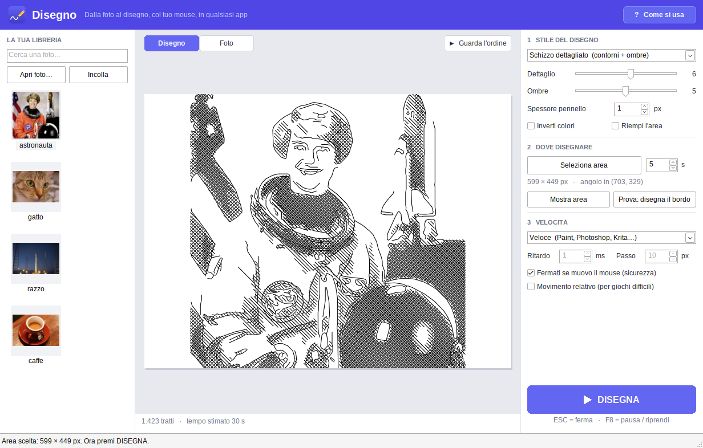
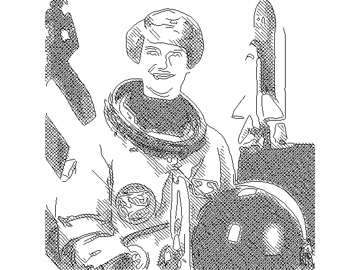

# Disegno

**Dalla foto al disegno, col tuo mouse, in qualsiasi app.**

Scegli una foto e Disegno la trasforma in linee e ombre. Poi prende il controllo del
mouse e la disegna da solo dentro l'app che vuoi: Paint, Photoshop, Krita, un sito
come skribbl.io o Gartic Phone, le mappe di disegno di **Roblox**… qualsiasi
programma in cui si disegna tenendo premuto il tasto sinistro del mouse.



Questo disegno è stato fatto interamente dal mouse, guidato da Disegno:



## Scarica

Nella pagina **[Releases](https://github.com/BitJacker/disegno/releases)** trovi due file
(li trovi anche in **[Actions](https://github.com/BitJacker/disegno/actions)** → l'ultimo
*Build* → allegato «Disegno»):

| File | Cos'è |
|---|---|
| `Disegno-1.0.0-setup.msi` | Installer: mette Disegno nel menu Start e sul Desktop |
| `Disegno.exe` | Versione portatile: non si installa, fai doppio clic e parte |

Funziona su Windows 10 e 11 (64 bit). Non servono altri programmi.

> Windows potrebbe mostrare «Windows ha protetto il PC» perché il programma non è firmato
> digitalmente: clicca **Ulteriori informazioni → Esegui comunque**.

## Come si usa

1. **Scegli la foto**: premi **Apri foto…**, trascinala nella finestra, oppure copiala
   (anche dal browser, tasto destro → *Copia immagine*) e premi **Ctrl+V**. Va bene anche
   il link di un'immagine. Ogni foto resta salvata nella **libreria** a sinistra.
2. **Scegli lo stile**, il **dettaglio** e le **ombre**: l'anteprima al centro mostra
   esattamente cosa verrà disegnato, con il numero di tratti e il tempo stimato.
   Con **Guarda l'ordine** vedi in che ordine verranno fatti i tratti.
3. **Apri l'app dove vuoi disegnare** e scegli la matita o il pennello.
   Imposta in Disegno lo **spessore del pennello** uguale a quello dell'app.
4. Premi **Seleziona area**. Hai **5 secondi** per portare il mouse nell'angolo **in alto a
   sinistra** del foglio (resta fermo lì), poi altri 5 secondi per l'angolo **in basso a
   destra**. Sullo schermo vedi un mirino, il conto alla rovescia e il riquadro che si
   forma. I secondi si possono cambiare.
5. Premi **DISEGNA**: dopo il conto alla rovescia il mouse comincia a disegnare.
   **Non toccare il mouse** finché non ha finito.

Il pulsante **Prova: disegna il bordo** disegna solo il contorno dell'area: utile per
controllare di aver scelto il posto giusto prima di un disegno lungo.

### Tasti

| Tasto | Cosa fa |
|---|---|
| **ESC** | Ferma subito il disegno (o annulla la selezione dell'area) |
| **F8** | Pausa / riprendi |
| **F5** | Disegna |
| **F6** | Seleziona area |
| **Ctrl+V** | Incolla una foto o il link di una foto |
| **Ctrl+O** | Apri foto |
| **F1** | Aiuto |

Per sicurezza, se **muovi il mouse** mentre disegna, Disegno si ferma da solo
(si può disattivare).

## Gli stili

| Stile | Risultato | Velocità |
|---|---|---|
| **Contorni** | Solo le linee principali, come un disegno a matita | La più veloce |
| **Schizzo dettagliato** | Contorni + ombre a tratteggio incrociato | Media |
| **Tratteggio** | Solo ombre, come un'incisione | Media |
| **Retino** | Puntini riga per riga, il più simile alla foto | Lenta |

- **Dettaglio**: più alto = più linee e più precisione, ma più tempo.
- **Ombre**: quanto sono ampie e scure le ombre (0 = nessuna).
- **Spessore pennello**: lo spessore della matita/pennello nell'app, in pixel. Con pennelli
  grossi Disegno usa meno linee, così non si impastano.
- **Inverti colori**: per disegnare col bianco su un foglio scuro.
- **Riempi l'area**: allarga la foto a tutta l'area anche se ha proporzioni diverse.

## Consigli per ogni app

| App | Velocità | Consigli |
|---|---|---|
| **Paint** | Veloce | Matita, spessore 1–2 px. Qualsiasi stile. |
| **Photoshop, Krita, GIMP** | Veloce o Normale | Disattiva la stabilizzazione del tratto se è molto forte. |
| **Siti web** (skribbl, Gartic…) | Siti web | Il browser legge il mouse più lentamente: stile Contorni o poco dettaglio. |
| **Roblox** | Giochi (Roblox) | Stile **Contorni** o dettaglio basso, spessore uguale al pennello del gioco. Se il gioco non disegna niente prova **Movimento relativo**. Per fermare senza aprire il menu di Roblox, **muovi il mouse** invece di premere ESC. |

Se il disegno perde dei pezzi, scegli una velocità più lenta (o *Personalizzata* con un
ritardo più alto). Se l'app è stata avviata **come amministratore**, avvia anche Disegno
come amministratore, altrimenti Windows blocca il mouse simulato.

> Alcuni giochi online vietano gli strumenti automatici: controlla le regole del gioco
> prima di usarlo.

## La libreria (database)

Tutte le foto che usi vengono salvate in un piccolo database (SQLite) insieme alla
miniatura, alle ultime impostazioni usate per quella foto e allo storico dei disegni.
Clicca una foto della libreria per riusarla; con il **tasto destro** puoi rinominarla,
esportarla o eliminarla. C'è anche una casella per cercarle per nome.

- Il database si trova in `%LOCALAPPDATA%\Disegno\libreria.db`.
- **Modalità portatile**: se accanto a `Disegno.exe` crei un file vuoto chiamato
  `disegno-portable.txt`, la libreria viene salvata lì (comodo su una chiavetta USB).

Tutto resta sul tuo computer: Disegno non invia niente su Internet (si collega solo se
incolli il link di un'immagine, per scaricarla).

## Domande frequenti

**Disegna nel posto sbagliato.** Riseleziona l'area: le coordinate dipendono dalla
posizione della finestra dell'app. Se sposti o ridimensioni l'app, rifai «Seleziona area».

**Non disegna niente nel gioco.** Prova la velocità *Giochi* o *Molto lenta*, poi
*Movimento relativo*. Assicurati che nel gioco sia selezionato lo strumento per disegnare.

**Il disegno è troppo scuro / le linee si toccano.** Aumenta lo *spessore pennello* in
Disegno fino a quello vero dell'app, oppure abbassa *Ombre* o *Dettaglio*.

**Ci mette troppo.** Usa lo stile *Contorni*, abbassa il dettaglio o scegli un'area più piccola.
Il tempo stimato è sotto l'anteprima.

## Per sviluppatori

Il programma è scritto in C++17 con le API Win32 (nessuna dipendenza esterna, exe di ~2 MB):

```
src/core/     motore portatile: foto → tratti (contorni Canny, tratteggio, retino),
              ordine dei tratti, stima dei tempi, anteprima
src/win/      app Windows: interfaccia, libreria SQLite, lettura immagini (WIC),
              overlay per scegliere l'area, disegno col mouse (SendInput)
installer/    pacchetto MSI (WiX)
tests/        test del motore
tools/        preview_cli (anteprima da riga di comando), testcanvas (tela per i test)
```

Compilare exe e MSI da Linux (Ubuntu):

```bash
sudo apt install mingw-w64 wixl msitools cmake ninja-build
./scripts/build.sh          # crea dist/Disegno.exe e dist/Disegno-<versione>-setup.msi
```

Test del motore:

```bash
cmake -S . -B build/linux -G Ninja && cmake --build build/linux && ctest --test-dir build/linux
```

Su Windows si può compilare con Visual Studio (CMake) o MSYS2/MinGW. La GitHub Action in
`.github/workflows/build.yml` compila e allega exe e MSI a ogni push; sul ramo `main`
(o avviandola a mano da *Actions → Build → Run workflow*) pubblica anche la release.

Librerie incluse: [SQLite](https://sqlite.org) (pubblico dominio) e
[stb_image / stb_image_write](https://github.com/nothings/stb) (pubblico dominio / MIT).
