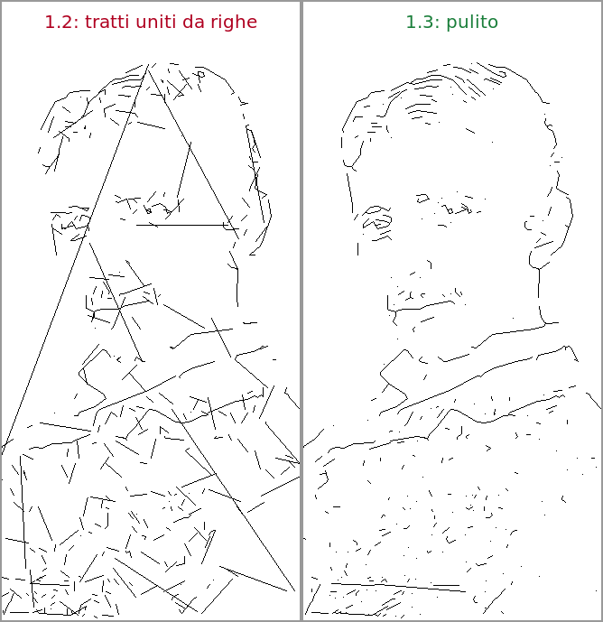
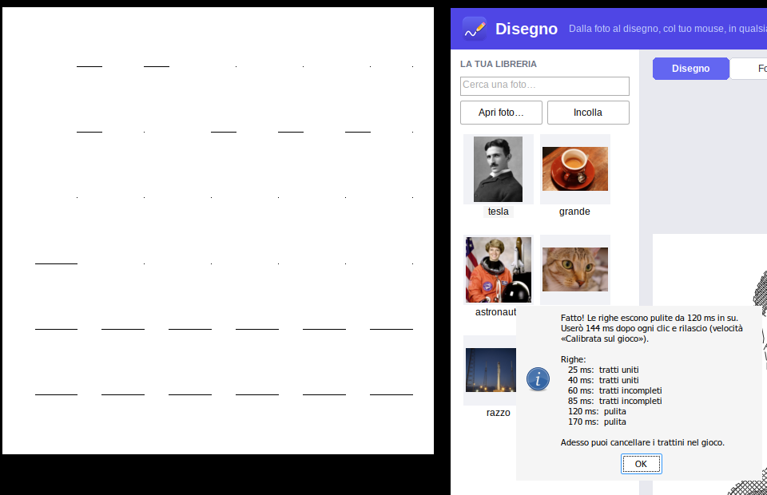
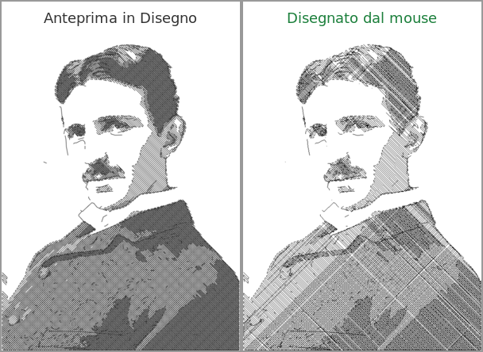
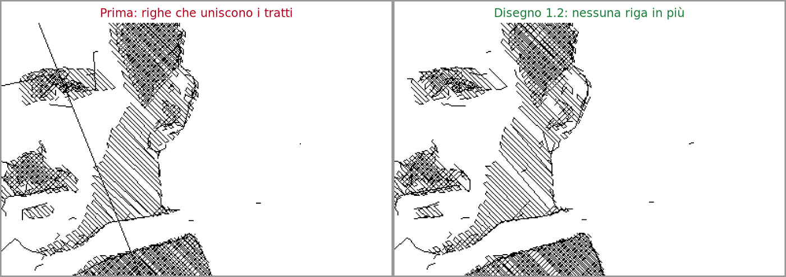

# Disegno

**Dalla foto al disegno, col tuo mouse, in qualsiasi app.**

Scegli una foto e Disegno la trasforma in linee e ombre. Poi prende il controllo del
mouse e la disegna da solo dentro l'app che vuoi: Paint, Photoshop, Krita, un sito
come skribbl.io o Gartic Phone, le mappe di disegno di **Roblox**… qualsiasi
programma in cui si disegna tenendo premuto il tasto sinistro del mouse.


Questo ritratto di Nikola Tesla è stato fatto interamente dal mouse, guidato da Disegno, in
circa 4 minuti e mezzo (con *Tempo massimo* a 5 minuti), su una tela di prova che si comporta
come un gioco di Roblox: guarda il mouse una volta per fotogramma e vede i clic con 60 ms di
ritardo.


## Scarica

Nella pagina **[Releases](https://github.com/BitJacker/disegno/releases)** trovi due file
(li trovi anche in **[Actions](https://github.com/BitJacker/disegno/actions)** → l'ultimo
*Build* → allegato «Disegno»):

| File | Cos'è |
|---|---|
| `Disegno-<versione>-setup.msi` | Installer: mette Disegno nel menu Start e sul Desktop |
| `Disegno.exe` | Versione portatile: non si installa, fai doppio clic e parte |

Funziona su Windows 10 e 11 (64 bit). Non servono altri programmi.

> Windows potrebbe mostrare «Windows ha protetto il PC» perché il programma non è firmato
> digitalmente: clicca **Ulteriori informazioni → Esegui comunque**.

## Come si usa

1. **Scegli la foto**: premi **Apri foto…**, trascinala nella finestra, oppure copiala
   (anche dal browser, tasto destro → *Copia immagine*) e premi **Ctrl+V**. Va bene anche
   il link di un'immagine. Ogni foto resta salvata nella **libreria** a sinistra.
2. **Scegli lo stile**, il **dettaglio** e le **ombre**: l'anteprima al centro mostra
   esattamente cosa verrà disegnato, con il numero di tratti e il tempo stimato.
   Con **Guarda l'ordine** vedi in che ordine verranno fatti i tratti.
3. **Apri l'app dove vuoi disegnare** e scegli la matita o il pennello.
   Imposta in Disegno lo **spessore del pennello** uguale a quello dell'app.
4. Premi **Seleziona area**. Hai **5 secondi** per portare il mouse nell'angolo **in alto a
   sinistra** del foglio (resta fermo lì), poi altri 5 secondi per l'angolo **in basso a
   destra**. Sullo schermo vedi un mirino, il conto alla rovescia e il riquadro che si
   forma. I secondi si possono cambiare.
5. Premi **DISEGNA**: dopo il conto alla rovescia il mouse comincia a disegnare.
   **Non toccare il mouse** finché non ha finito.

Il pulsante **Prova: disegna il bordo** disegna solo il contorno dell'area: utile per
controllare di aver scelto il posto giusto prima di un disegno lungo.

Nei giochi, la prima volta premi anche **Calibra per questo gioco** (vedi sotto): in mezzo
minuto Disegno capisce da solo quanto andare piano perché i tratti non si uniscano.

### Tasti

| Tasto | Cosa fa |
|---|---|
| **ESC** | Ferma subito il disegno (o annulla la selezione dell'area) |
| **F8** | Pausa / riprendi |
| **F5** | Disegna |
| **F6** | Seleziona area |
| **Ctrl+V** | Incolla una foto o il link di una foto |
| **Ctrl+O** | Apri foto |
| **F1** | Aiuto |

Per sicurezza, se **muovi il mouse** mentre disegna, Disegno si ferma da solo
(si può disattivare).

## Gli stili

| Stile | Risultato | Velocità |
|---|---|---|
| **Contorni** | Solo le linee principali, come un disegno a matita | La più veloce |
| **Schizzo dettagliato** | Contorni + ombre a tratteggio incrociato | Media |
| **Tratteggio** | Solo ombre, come un'incisione | Media |
| **Puntini** | Puntini riga per riga: dettagliatissimo, il più simile alla foto | Lenta (un clic per puntino) |
| **Righe** | La foto fatta di righe orizzontali, come una stampa | Veloce: il più dettagliato nei giochi a tempo |

- **Dettaglio**: più alto = più linee e più precisione, ma più tempo.
- **Ombre**: quanto sono ampie e scure le ombre (0 = nessuna).
- **Spessore pennello**: lo spessore della matita/pennello nell'app, in pixel. Con pennelli
  grossi Disegno usa meno linee, così non si impastano.
- **Inverti colori**: per disegnare col bianco su un foglio scuro.
- **Riempi l'area**: allarga la foto a tutta l'area anche se ha proporzioni diverse.

## La velocità

Con **Automatica** (consigliata) Disegno guarda quale app c'è sotto l'area scelta e usa i
tempi giusti: *Veloce* per Paint e i programmi di disegno, *Siti web* per i browser,
*Roblox e giochi* per Roblox, *Normale* per tutto il resto. Sotto la lista c'è scritto
cosa fa la velocità scelta.

Perché i giochi sono diversi: Roblox (e molti giochi) guarda il mouse una volta per
fotogramma e unisce con una riga dritta le posizioni che vede. In più spesso si accorge dei
clic **qualche fotogramma in ritardo**, mentre il mouse lo segue subito: se dopo un rilascio
il mouse parte subito verso il tratto successivo, il gioco crede che il tasto sia ancora
premuto e disegna il salto (le righe lunghe che attraversano il disegno). Con *Roblox e
giochi*:

- dopo ogni clic e ogni rilascio il mouse **resta fermo 70 ms**, così il gioco se ne accorge
  prima che il mouse si sposti;
- il mouse salta da un angolo all'altro del tratto e resta fermo su ogni angolo circa **due
  fotogrammi**, così un fotogramma perso non taglia le curve;
- dopo ogni clic e rilascio Disegno **aspetta che il gioco li abbia presi**: se il gioco si
  blocca per un attimo, Disegno lo aspetta.

Per i giochi più lenti c'è **Giochi lenti o che scattano** (110 ms).

### Calibra per questo gioco

Ogni gioco (e ogni computer) è diverso. Scegli l'area su un foglio vuoto e premi **Calibra per
questo gioco**: Disegno fa 6 righe di trattini, ognuna con una pausa più lunga dopo i clic, poi
guarda lo schermo e vede quali righe sono uscite pulite (trattini separati e completi). Sceglie
la più veloce tra quelle pulite, con un po' di margine, e passa alla velocità **Calibrata sul
gioco**. Poi puoi cancellare i trattini nel gioco.

### Tempo massimo

Nei giochi a tempo attivalo e scrivi i secondi a disposizione (**300** per un round da 5
minuti). Se il disegno ci metterebbe di più, Disegno **abbassa il dettaglio quanto basta**
per finire in tempo; solo se non basta toglie i pezzettini e le ombre meno importanti. Se
invece **avanza tempo**, con *Usa il tempo che avanza* Disegno va più piano (fino a 3
volte): il gioco vede meglio ogni clic, rilascio e angolo, e il disegno finisce comunque
entro il tempo. L'anteprima mostra esattamente cosa verrà disegnato e il riepilogo sopra
DISEGNA dice quanto ci metterà.

Con *Roblox e giochi* un ritratto a dettaglio massimo (area 1140 × 640) richiede circa:
*Contorni* 3 min, *Schizzo* 4 min 30 s, *Righe* 4 min 40 s. Con *Puntini* ogni puntino è
un clic: con poco tempo Disegno li ingrandisce da solo per starci.

## Consigli per ogni app

| App | Velocità | Consigli |
|---|---|---|
| **Paint** | Automatica (o Veloce) | Matita, spessore 1–2 px. Qualsiasi stile. |
| **Photoshop, Krita, GIMP** | Automatica | Disattiva la stabilizzazione del tratto se è molto forte. |
| **Siti web** (skribbl, Gartic…) | Automatica (o Siti web) | Stile Contorni o poco dettaglio. |
| **Roblox** | Automatica, poi **Calibra per questo gioco** | Stile **Schizzo** o **Righe**, spessore uguale al pennello del gioco, **stabilizzatore del gioco a 0**, zoom del foglio al 100%. Nei round a tempo usa **Tempo massimo** (300 s per 5 minuti). Se non disegna niente prova **Movimento relativo**. |

Se il disegno perde dei pezzi o i tratti vengono uniti da righe, nei giochi premi **Calibra
per questo gioco**; nelle altre app scegli una velocità più lenta (*Molto lenta*, o
*Personalizzata*: con *Passo* 0 il mouse va da un angolo all'altro come nei giochi e il
*Ritardo* è quanto resta fermo dopo ogni clic e rilascio). Se l'app è stata
avviata **come amministratore**, avvia anche Disegno come amministratore, altrimenti
Windows blocca il mouse simulato.

> Alcuni giochi online vietano gli strumenti automatici: controlla le regole del gioco
> prima di usarlo.

## La libreria (database)

Tutte le foto che usi vengono salvate in un piccolo database (SQLite) insieme alla
miniatura, alle ultime impostazioni usate per quella foto e allo storico dei disegni.
Clicca una foto della libreria per riusarla; con il **tasto destro** puoi rinominarla,
esportarla o eliminarla. C'è anche una casella per cercarle per nome.

- Il database si trova in `%LOCALAPPDATA%\Disegno\libreria.db`.
- **Modalità portatile**: se accanto a `Disegno.exe` crei un file vuoto chiamato
  `disegno-portable.txt`, la libreria viene salvata lì (comodo su una chiavetta USB).

Tutto resta sul tuo computer: Disegno non invia niente su Internet (si collega solo se
incolli il link di un'immagine, per scaricarla).

## Le prove

Disegno è provato su una **tela di prova** (`tools/testcanvas`) che si comporta come un gioco:
guarda il mouse una volta per fotogramma, può andare a scatti e può vedere i clic in ritardo.
Il mouse vero viene mosso da Disegno, sotto Wine, e il risultato viene confrontato con
l'anteprima. Alcune foto delle prove:

**Un gioco che vede i clic 60 ms in ritardo.** A sinistra la versione 1.2, che dopo ogni
rilascio ripartiva subito: il gioco disegna i salti tra un tratto e l'altro. A destra la 1.3.



**La calibrazione** sulla stessa tela: con pause corte i trattini escono uniti o incompleti,
da 120 ms in su puliti. Disegno sceglie 144 ms.



**Anteprima e risultato**: l'esempio di Tesla in alto, a confronto con l'anteprima (manca
l'1,3% dell'inchiostro, nessuna riga in più).



**Un gioco che scatta** (45 fps e blocchi fino a 170 ms): senza aspettare il gioco, due
tratti restano uniti; aspettandolo, no.



## Domande frequenti

**Disegna nel posto sbagliato.** Riseleziona l'area: le coordinate dipendono dalla
posizione della finestra dell'app. Se sposti o ridimensioni l'app, rifai «Seleziona area».

**Nel gioco i tratti vengono uniti da righe lunghe** (il tasto sembra sempre premuto).
Il gioco vede il rilascio del tasto in ritardo e intanto il mouse era già partito: premi
**Calibra per questo gioco**, che trova da solo la pausa giusta. In alternativa scegli
*Giochi lenti o che scattano*.

**Non disegna niente nel gioco.** Prova la velocità *Roblox e giochi* o *Molto lenta*, poi
*Movimento relativo*. Assicurati che nel gioco sia selezionato lo strumento per disegnare.

**Il disegno è troppo scuro / le linee si toccano.** Aumenta lo *spessore pennello* in
Disegno fino a quello vero dell'app, oppure abbassa *Ombre* o *Dettaglio*.

**Ci mette troppo.** Attiva *Tempo massimo*: Disegno abbassa da solo il dettaglio per finire
in tempo. Nei giochi lo stile *Righe* dà tanto dettaglio nello stesso tempo; *Contorni* è il
più veloce. Il tempo stimato è nel riepilogo sopra DISEGNA.

## Per sviluppatori

Il programma è scritto in C++17 con le API Win32 (nessuna dipendenza esterna, exe di ~2 MB):

```
src/core/     motore portatile: foto → tratti (linee, tratteggio, righe, puntini),
              ordine dei tratti, piano dei movimenti del mouse e stima dei tempi,
              anteprima, simulatore di un gioco che guarda il mouse a ogni fotogramma
src/win/      app Windows: interfaccia, libreria SQLite, lettura immagini (WIC),
              overlay per scegliere l'area, disegno col mouse (SendInput)
installer/    pacchetto MSI (WiX)
tests/        test del motore
tools/        preview_cli (anteprima da riga di comando; con --sim e --lag mostra cosa
              vedrebbe un gioco a N fps con scatti e clic visti in ritardo), testcanvas
              (tela per i test, anche in modalità «gioco»: fotogrammi, scatti e ritardo
              dei clic configurabili), capturetest (controlla la cattura dello schermo
              usata dalla calibrazione)
```

Compilare exe e MSI da Linux (Ubuntu):

```bash
sudo apt install mingw-w64 wixl msitools cmake ninja-build
./scripts/build.sh          # crea dist/Disegno.exe e dist/Disegno-<versione>-setup.msi
```

Test del motore:

```bash
cmake -S . -B build/linux -G Ninja && cmake --build build/linux && ctest --test-dir build/linux
```

Su Windows si può compilare con Visual Studio (CMake) o MSYS2/MinGW. La GitHub Action in
`.github/workflows/build.yml` compila e allega exe e MSI a ogni push; sul ramo `main`
(o avviandola a mano da *Actions → Build → Run workflow*) pubblica anche la release.

Librerie incluse: [SQLite](https://sqlite.org) (pubblico dominio) e
[stb_image / stb_image_write](https://github.com/nothings/stb) (pubblico dominio / MIT).
La foto di Nikola Tesla usata negli esempi (Napoleon Sarony, circa 1890) è di pubblico
dominio.
